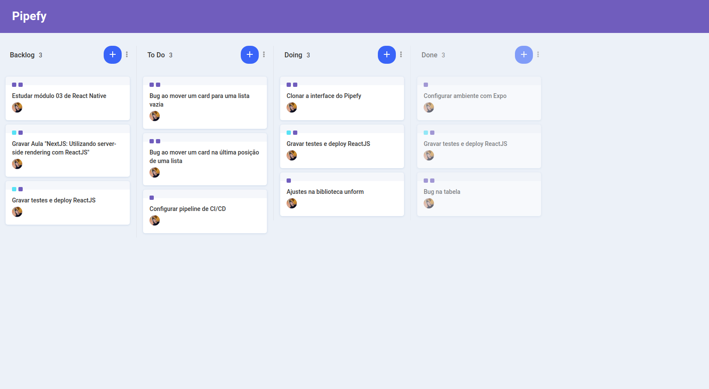

## <div align="center"></div>

###



<p align="center">📑 A clone of Pipefy's project management interface with drag and drop </p>

## 🛠️ Technologies

<ul>
  <li><a href="https://reactjs.org/">React</a></li>
  <li><a href="https://react-dnd.github.io/react-dnd/about">React DnD</a></li>
  <li><a href="https://pt-br.reactjs.org/docs/context.html#reactcreatecontext">Context API</a></li>
  <li><a href="https://immerjs.github.io/immer/docs/introduction">Immer.js</a></li>
  <li><a href="https://styled-components.com/">Styled Components</a></li>
  <li><a href="https://www.typescriptlang.org/">TypeScript</a></li>
</ul>

## ⚙️ Requirements

<ul>
  <li><a href="https://git-scm.com/">Git</a></li>
  <li><a href="https://nodejs.org/en/">Node.js</a></li>
  <li><a href="https://www.typescriptlang.org/">Yarn</a></li>
</ul>

## 🚀 Installation

```bash
$ git clone https://github.com/gabrielsanttana/pipefy
$ cd pipefy
$ yarn
$ yarn start
```

The application will pop-up in the browser on http://localhost:3000

## ⚖️ License

[MIT License](https://github.com/gabrielsanttana/pipefy/blob/master/LICENSE)

<h6 align="center">Made with ❤️ by <a href="https://linkedin.com/in/gabrielsanttana">Gabriel Santana</a></h6>
